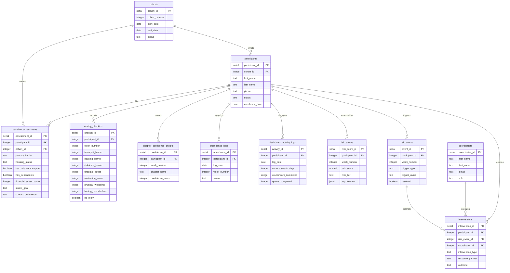

```mermaid
erDiagram
    %% ── CORE ──────────────────────────────────────────────
    participants {
        serial participant_id PK
        integer cohort_id FK
        text first_name
        text last_name
        text phone
        text status
        date enrollment_date
    }

    cohorts {
        serial cohort_id PK
        integer cohort_number
        date start_date
        date end_date
        text status
    }

    %% ── INPUT LAYER (left) ────────────────────────────────
    baseline_assessments {
        serial assessment_id PK
        integer participant_id FK
        integer cohort_id FK
        text primary_barrier
        text housing_status
        boolean has_reliable_transport
        boolean has_dependents
        integer financial_stress_score
        text stated_goal
        text contact_preference
    }

    weekly_checkins {
        serial checkin_id PK
        integer participant_id FK
        integer week_number
        integer transport_barrier
        integer housing_barrier
        integer childcare_barrier
        integer financial_stress
        integer motivation_score
        integer physical_wellbeing
        integer feeling_overwhelmed
        boolean no_reply
    }

    chapter_confidence_checks {
        serial confidence_id PK
        integer participant_id FK
        integer week_number
        text chapter_name
        integer confidence_score
    }

    attendance_logs {
        serial attendance_id PK
        integer participant_id FK
        date log_date
        integer week_number
        text status
    }

    dashboard_activity_logs {
        serial activity_id PK
        integer participant_id FK
        date log_date
        integer current_streak_days
        integer coursework_completed
        integer quests_completed
    }

    %% ── RISK LAYER (right) ────────────────────────────────
    risk_scores {
        serial risk_score_id PK
        integer participant_id FK
        integer week_number
        numeric risk_score
        text risk_tier
        jsonb top_features
    }

    risk_events {
        serial event_id PK
        integer participant_id FK
        integer week_number
        text trigger_type
        text trigger_value
        boolean resolved
    }

    %% ── INTERVENTION LAYER (bottom-right) ─────────────────
    interventions {
        serial intervention_id PK
        integer participant_id FK
        integer risk_event_id FK
        integer coordinator_id FK
        text intervention_type
        text resource_partner
        text outcome
    }

    coordinators {
        serial coordinator_id PK
        text first_name
        text last_name
        text email
        text role
    }

    %% ── RELATIONSHIPS ─────────────────────────────────────
    %% cohorts → participants (top)
    cohorts             ||--o{ participants              : "enrolls"

    %% participants → input layer (left)
    cohorts             ||--o{ baseline_assessments      : "scopes"
    participants        ||--o{ baseline_assessments      : "fills"
    participants        ||--o{ weekly_checkins           : "submits"
    participants        ||--o{ chapter_confidence_checks : "scores"
    participants        ||--o{ attendance_logs           : "logged in"
    participants        ||--o{ dashboard_activity_logs   : "engages"

    %% participants → risk layer (right)
    participants        ||--o{ risk_scores               : "assessed by"
    participants        ||--o{ risk_events               : "triggers"

    %% risk → intervention layer (bottom-right)
    risk_events         ||--o{ interventions             : "prompts"
    coordinators        ||--o{ interventions             : "executes"
    participants        ||--o{ interventions             : "receives"
```
